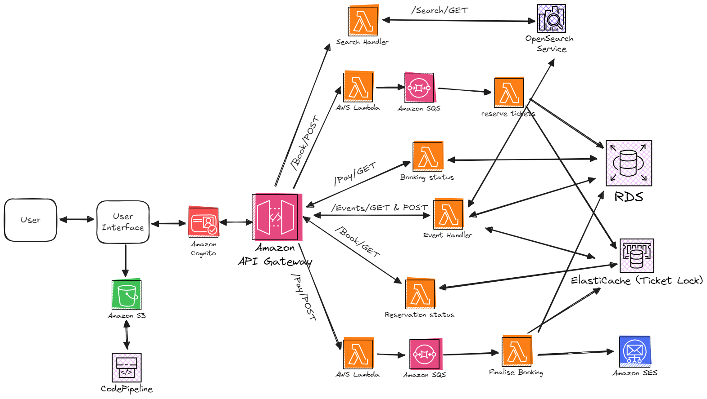

---

# VioletPass: A Scalable Ticket Booking System

VioletPass is a robust, scalable ticket booking platform designed to simplify **event management**, **seat reservations**, and **payment processing** while ensuring high availability and fault tolerance using AWS services.

---

## Key Features

### 1. **Role-Based Access Control**  
- **User Role**:  
   - View events, manage bookings (view/cancel).  
   - Receive unique **QR codes** for tickets to confirm attendance.  
- **Admin Role**:  
   - Manage events via an **Admin Dashboard**:  
     - Create events.  
     - View booking statistics and seat availability.  
     - Scan QR codes to validate entry and prevent duplicate use.  

### 2. **Event Management**  
- Create/manage events with metadata like name, venue, date, and seat capacity.  

### 3. **Real-Time Seat Reservation**  
- Seat locking with **Redis Elasticache**:  
   - Prevents double booking with a 10-minute lock expiration.  

### 4. **Search and Notifications**  
- **Event Search**: Fast and intuitive via **Amazon OpenSearch**.  
- **Notifications**: **AWS SES** sends booking confirmations, cancellations, and payment details.  

### 5. **QR Code Generation**  
- Unique QR codes for each booking; scanned by admins to validate attendance.  

---

## System Architecture

The platform leverages AWS services to ensure scalability and reliability:  
- **Amazon API Gateway**: Routes requests to **AWS Lambda**.  
- **AWS Lambda**: Handles seat reservations, payments, and event logic.  
- **Redis Elasticache**: Manages locks to prevent duplicate bookings.  
- **Amazon RDS (PostgreSQL)**: Stores event, seat, and booking data.  
- **Amazon OpenSearch**: Supports event searches.  
- **Amazon SES**: Sends email notifications.  
- **Amazon S3**: Hosts frontend assets.  
- **Amazon Cognito**: Manages user authentication.  
- **AWS CodePipeline**: CI/CD automation for deployments.  

---

## Booking Workflow  
1. **Event Search**: Users search for events.  
2. **Seat Reservation**: Selected seats are locked via Redis.  
3. **Payment**: Secure payment processing confirms bookings.  
4. **QR Code**: A unique QR code is generated for validated bookings.  
5. **Admin Actions**: Admins scan QR codes, manage events, and view booking statistics.

---

# React + Vite

This template provides a minimal setup to get React working in Vite with HMR and some ESLint rules.

Currently, two official plugins are available:
- [@vitejs/plugin-react](https://github.com/vitejs/vite-plugin-react/blob/main/packages/plugin-react/README.md) uses [Babel](https://babeljs.io/) for Fast Refresh
- [@vitejs/plugin-react-swc](https://github.com/vitejs/vite-plugin-react-swc) uses [SWC](https://swc.rs/) for Fast Refresh